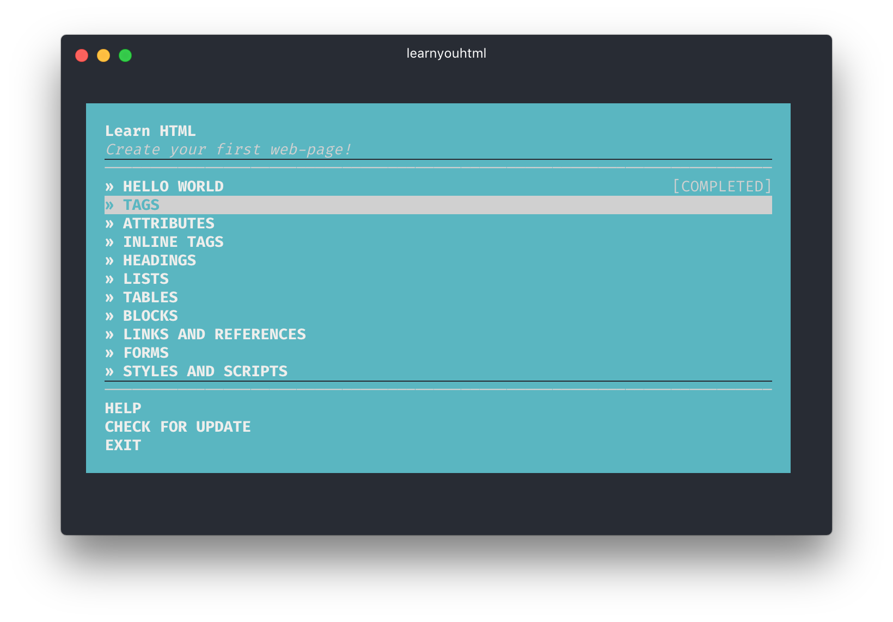

# Learn you HTML

***

## Objetivo

Completar los ejercicios de este respositorio https://github.com/denysdovhan/learnyouhtml.

## Epecificaciones

* Para realizar este proyecto se utilizo la consola CMD para poder ejecutar el programa.

* Durante la realización de cada ejercicio se realizó la respectiva captura de pantalla de los resultados obtenidos y se organizo en una página web `index.html` .

* Página principal : `index.html` en el cual se encuentra la estructura html y los enlaces con las dos hojas de estilos utilizadas.

* En la carpeta `css` se encuentra el archivo `main.css` donde se encuentran los archivos del proyecto.

* Dentro de la carpeta `assets` se encuentra la carpeta `images` donde
  se encuentran las imágenes capturadas del desarrollo de cada ejercicio  y tambien se encuentra la carpeta `icon` la cual contiene los iconos a utilizar.

## Página web terminada

* Luego del proceso de desarrollo de la página web podemos mostrar los resultados:

## Autor

Carla Centeno Ramos
